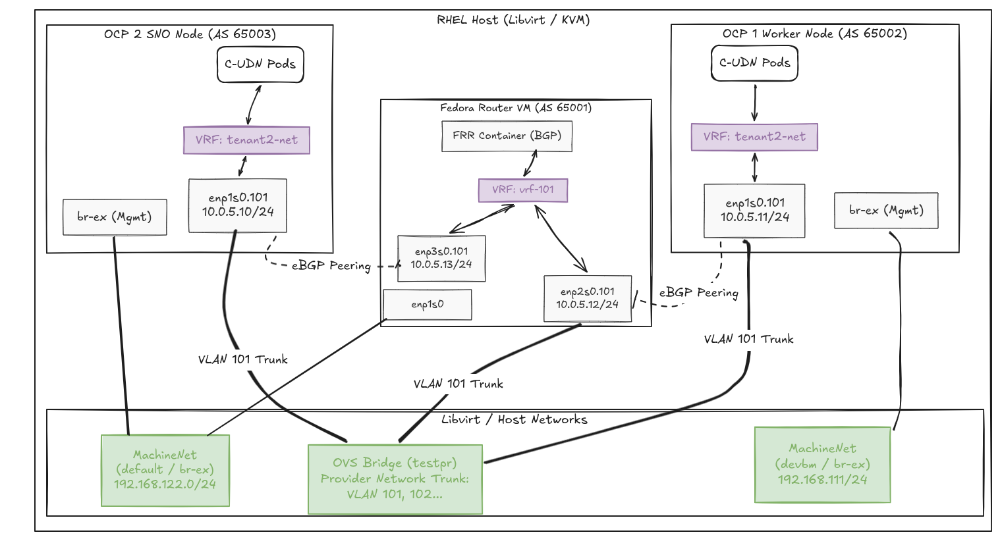

# OCP ClusterUserDefinedNetwork (C-UDN) with VRF-Lite Lab

This repository provisions a C-UDN integrated with a Provider Network fabric using BGP and VRF-Lite. It ensures strict network isolation for tenant workloads across OpenShift clusters.

## Architecture

Quick Start
You can run the entire lab using the provided Makefile. The oc commands run locally, while the host configuration scripts are injected securely over SSH.

1. Prepare the Cluster Operators
From your Bastion/Laptop with oc access:

Bash

make patch-cluster
2. Setup Host Networking (VLAN/VRF)
This step executes via SSH on the target OpenShift Worker Node.

Bash

make host-net SSH_USER=core WORKER_IP=192.168.122.100
3. Deploy the Tenant Manifests
Deploys the Namespace, C-UDN, and FRR Configurations to the cluster:

Bash

make tenant-deploy
4. Setup the Provider Bridge
This step executes via SSH on the Libvirt hypervisor host to create the OVS bridge and network:

Bash

make router-bridge HYPERVISOR_USER=root HYPERVISOR_IP=192.168.122.1
5. Test Connectivity
Deploy a netshoot pod into the isolated namespace to verify routing:

Bash

make test-pod
oc exec -it netshoot -n tenant1 -- ping 10.0.5.12
Router VM Provisioning (Manual)
To complete the lab, you must provision the Fedora Router VM.

Download the Fedora QCOW2 and run virt-install.

Connect via console to configure SSH (PermitRootLogin yes, PasswordAuthentication yes).

Attach the OVS VLAN trunk to the VM via virsh edit <vm-name>:

XML

<vlan trunk="yes">
  <tag id="101"/>
  <tag id="102"/>
  <tag id="103"/>
</vlan>
Create the VRF and VLAN inside the VM, then deploy the FRR Podman container.

